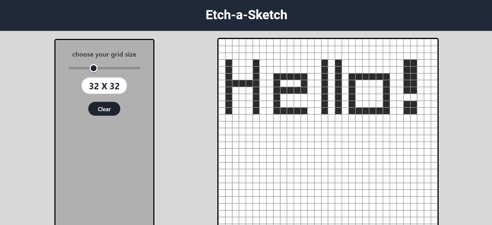

# 🖊️ Etch-a-Sketch

A browser-based recreation of the classic Etch-a-Sketch toy, built with vanilla HTML, CSS, and JavaScript. Drag your mouse across the grid to "draw," adjust the grid size with a slider, and reset whenever you want a clean slate.

🔗 **Live Demo:** [Add your live link here](https://your-live-link-here.com)

---

## ✨ Features

- **Draw by dragging** — click and drag across the grid to shade cells, just like the real toy (click alone also works on a single cell)
- **Adjustable grid size** — slider lets you pick anywhere from **16×16** to **128×128** cells, with the current size displayed live
- **Reset button** — instantly clears the grid back to white without changing the current size
- **Smooth hover feedback** — cells transition to dark grey with a subtle animation as you draw
- **Responsive square canvas** — the grid always stays a perfect square and fills the available window, no matter the screen size or zoom level

---

## 🛠️ Built With

- **HTML5** — structure
- **CSS3** — Flexbox layout, `aspect-ratio` for responsive squares, custom range slider styling
- **JavaScript (Vanilla)** — dynamic grid generation, mouse event handling, no frameworks or libraries

---

## 🚀 How It Works

1. The grid is generated dynamically using CSS Grid — a `size × size` layout of `div` cells is created and injected into the DOM based on the slider value.
2. Each cell listens for `mousedown` and `mouseover` events; a global flag tracks whether the mouse button is held down, so cells only paint while actively dragging.
3. Moving the slider live-updates the grid size and rebuilds the cells.
4. The **Reset** button clears all painted cells while keeping the current grid size intact.

---

## 📄 License

This project is open source and available under the [MIT License](LICENSE).

---

## 🙋 Author

**a-azzamx**
Feel free to reach out or open an issue if you have suggestions!